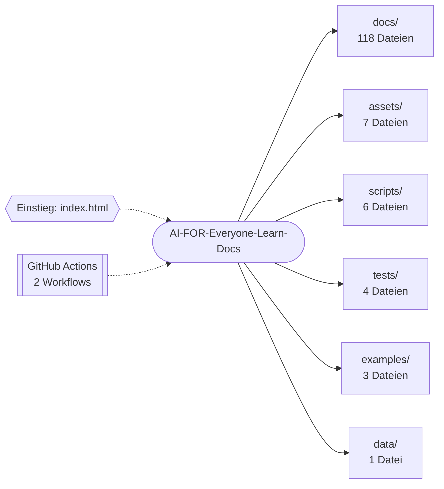

<div align="center">


# AI for Everyone — learn, build, and question AI

<p><strong>Offener zweisprachiger Lernleitfaden zu AI mit 36 Kapiteln als statische Website.</strong></p>
<p>


</p>
<p>
<a href="https://github.com/Pierreg99/AI-FOR-Everyone-Learn-Docs/actions/workflows/ci.yml"></a>
<a href="https://github.com/Pierreg99/AI-FOR-Everyone-Learn-Docs/actions/workflows/pages.yml"></a>
</p>
<p><a href="#schnellstart">Schnellstart</a> · <a href="#projektstruktur">Projektstruktur</a> · <a href="#english-summary">English</a></p>
</div>

<table>
<tr>
<td width="58%" valign="top">

### Bestand

Keine Beschreibung im Repo-Metadatum. Dieses README erfindet deshalb keine Funktionen, Releases oder Laufzeiten.

Der Default-Branch `main` ist die Fläche, die zählt. Was nicht in diesem Baum liegt, ist kein Feature dieses Repos.

</td>
<td width="42%" valign="top">

### Fakten

| Feld | Wert |
| --- | --- |
| Owner | Pierreg99 |
| Branch | `main` |
| Sichtbarkeit | öffentlich |
| Sprache | JavaScript |
| Archiv | nein |

</td>
</tr>
</table>

---

## Inhaltsverzeichnis

- [Bestand und Fakten](#bestand)
- [Überblick](#überblick)
- [Features](#features)
- [Schnellstart](#schnellstart)
- [Architektur](#architektur)
- [Projektstruktur](#projektstruktur)
- [Dokumentation](#dokumentation)
- [Projektdetails](#projektdetails)
- [English summary](#english-summary)

## Überblick

Offener zweisprachiger Lernleitfaden zu AI mit 36 Kapiteln als statische Website.

| Merkmal | Wert |
| --- | --- |
| Sprachen | JavaScript (60%), CSS (39%) |
| Dateien im Repository | 162 |
| Einstiegspunkte | `index.html` |
| Version (`package.json`) | 2.2.0 |
| CI-Workflows | 2 |

## Features

- End-to-End-Tests mit Playwright
- Lokale Speicherung im Browser (localStorage)
- Kommandozeilen-Interface (argparse)
- SQLite-Datenhaltung
- Echtzeit-Render-Schleife (requestAnimationFrame)
- Automatisierung über GitHub Actions: `ci.yml`, `pages.yml`
- Veröffentlichung über GitHub Pages
- 4 Testdateien im Repository
- 133 Markdown-Dokumente

## Schnellstart

```bash
git clone https://github.com/Pierreg99/AI-FOR-Everyone-Learn-Docs.git
cd AI-FOR-Everyone-Learn-Docs
```

**Node.js**

```bash
npm install
npm run dev
npm run build
npm run preview
npm run test
npm run check
```

<details>
<summary>Alle Skripte aus <code>package.json</code></summary>

| Skript | Befehl |
| --- | --- |
| `build` | `node scripts/build.mjs` |
| `dev` | `npm run build && node scripts/serve.mjs` |
| `preview` | `node scripts/serve.mjs` |
| `test` | `node --test tests/*.test.mjs` |
| `test:e2e` | `playwright test` |
| `check` | `npm run format:check && npm run build && npm test` |
| `format` | `prettier --write "assets/*.{js,css}" "scripts/*.mjs" "tests/**/*.mjs" "data/*.json" ind...` |
| `format:check` | `prettier --check "assets/*.{js,css}" "scripts/*.mjs" "tests/**/*.mjs" "data/*.json" ind...` |
| `verify:deployment` | `node scripts/verify-deployment.mjs` |

</details>

## Architektur

Übersicht der wichtigsten Verzeichnisse nach Anzahl der enthaltenen Dateien.



## Projektstruktur

```text
AI-FOR-Everyone-Learn-Docs/
├── .github/  (2 Dateien)
│   └── workflows/
├── assets/  (7 Dateien)
│   ├── app.js
│   ├── core.js
│   ├── favicon.svg
│   ├── lab-data.js
│   ├── readme-banner.svg
│   ├── style.css
│   └── … (1 weitere)
├── data/  (1 Datei)
│   └── chapters.json
├── docs/  (118 Dateien)
│   ├── de/
│   ├── en/
│   ├── 01-ai-fundamentals.md
│   ├── 02-machine-learning.md
│   ├── 03-transformers-foundation-models.md
│   ├── 04-llms.md
│   └── … (30 weitere)
├── examples/  (3 Dateien)
│   ├── durable_job.py
│   ├── evaluate.py
│   └── retrieval.py
├── scripts/  (6 Dateien)
│   ├── build.mjs
│   ├── components.mjs
│   ├── content.mjs
│   ├── i18n.mjs
│   ├── serve.mjs
│   └── verify-deployment.mjs
├── tests/  (4 Dateien)
│   ├── browser/
│   ├── content.test.mjs
│   ├── core.test.mjs
│   └── examples.test.mjs
├── .gitignore
├── 25-distributed-agent-runtime-en.md
├── 25-distributed-agent-runtime.md
├── 26-durable-state-machines-en.md
├── 26-durable-state-machines.md
├── 27-tool-protocols-mcp-en.md
├── 27-tool-protocols-mcp.md
├── 28-memory-retrieval-evaluation-en.md
├── 28-memory-retrieval-evaluation.md
├── CONTRIBUTING.de.md
├── CONTRIBUTING.md
├── index.html
├── package-lock.json
├── package.json
├── playwright.config.mjs
└── … (5 weitere Einträge)
```

## Dokumentation

- [25-distributed-agent-runtime-en.md](25-distributed-agent-runtime-en.md)
- [25-distributed-agent-runtime.md](25-distributed-agent-runtime.md)
- [26-durable-state-machines-en.md](26-durable-state-machines-en.md)
- [26-durable-state-machines.md](26-durable-state-machines.md)
- [27-tool-protocols-mcp-en.md](27-tool-protocols-mcp-en.md)
- [27-tool-protocols-mcp.md](27-tool-protocols-mcp.md)
- [28-memory-retrieval-evaluation-en.md](28-memory-retrieval-evaluation-en.md)
- [28-memory-retrieval-evaluation.md](28-memory-retrieval-evaluation.md)
- [CONTRIBUTING.de.md](CONTRIBUTING.de.md)
- [CONTRIBUTING.md](CONTRIBUTING.md)
- [README-V1.2.md](README-V1.2.md)
- [README.de.md](README.de.md)
- [ROADMAP.md](ROADMAP.md)
- [WEBSITE.md](WEBSITE.md)

## Projektdetails

Der folgende Abschnitt übernimmt die bisherige Projektdokumentation.

**An open learning guide in English and German.** Explore 36 matched chapters, from machine learning and language models to RAG, agents, security, evaluation, and production engineering. Every chapter includes a worked example, a failure mode, an exercise with an answer, and links to primary reading.

[Open the English learning site](https://pierreg99.github.io/AI-FOR-Everyone-Learn-Docs/en/) · [Deutsch lesen](README.de.md) · [Deutsche Website öffnen](https://pierreg99.github.io/AI-FOR-Everyone-Learn-Docs/de/)

The website works as a static GitHub Pages site. It has no account, analytics service, external font dependency, or runtime API. Reading progress and bookmarks stay in the current browser. All chapters and navigation remain readable when JavaScript is disabled; search, interactive tools, and saved progress require JavaScript.

## Edition 2.1

A refreshed interface adds larger type, responsive navigation, a personal next-chapter panel, and a focused reading view (shortcut `F`). Export your progress as a JSON backup and import it on another browser: valid backups merge completed chapters and bookmarks without removing existing entries. Files are processed locally. German and English share the same progress.

## Find your starting point

- **Understand AI:** chapters 1–6 cover models, learning, Transformers, language models, generative AI, and RAG.
- **Build agents:** chapters 7–9, 14–15, 17, 24, 27, and 29–30 connect tools, context, permissions, runtime design, and tests.
- **Operate systems:** chapters 19–23, 25–26, 31–32, and 34–36 address observability, data, serving, recovery, evaluation, privacy, and costs.

The other chapters deepen architectures and research boundaries. AGI and ASI are capability and hypothetical future concepts; they are not guaranteed engineering milestones.

[English chapter index](docs/en/README.md) · [German chapter index](docs/de/README.md) · [Quick start](docs/en/getting-started.md) · [Glossary](docs/en/glossary.md) · [Sources](docs/en/sources.md) · [Practice projects](docs/en/projects.md)

## Run the website locally

Node.js 22+ and npm are required for the build. Python 3.10+ is required only for the optional examples.

```sh
npm ci
npm run check
npm run dev
```

Open `http://127.0.0.1:4173/`. The `dist/` folder contains the complete deployable site; no Node.js process is needed on GitHub Pages. After editing a chapter, run `npm run build` again. Browser tests can be run with `npx playwright install chromium && npm run test:e2e` where browser downloads are available.

See [WEBSITE.md](WEBSITE.md) for the file layout and deployment, [CONTRIBUTING.md](CONTRIBUTING.md) for editing guidelines, and [ROADMAP.md](ROADMAP.md) for completed work and open opportunities. Previous V1.2 entry points and chapter URLs remain as pointers to the current editions.

### Edition 2.2: clearer learning navigation

Learning paths show individual progress, finished chapters have a visible state, and completing the guide points to practice projects. A collapsible chapter outline is available on phones and tablets; desktop outlines highlight the current section. Deployment checks now verify the actual public German and English pages after publication.

## English summary

Open bilingual AI learning guide with 36 chapters as a static website.

Clone the repository and follow the commands in [Schnellstart](#schnellstart); the [project layout](#projektstruktur) shows where the code lives. Further documents are listed under [Dokumentation](#dokumentation).
