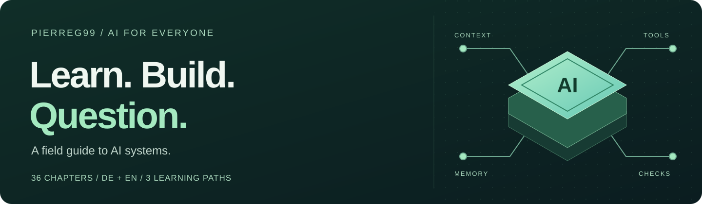
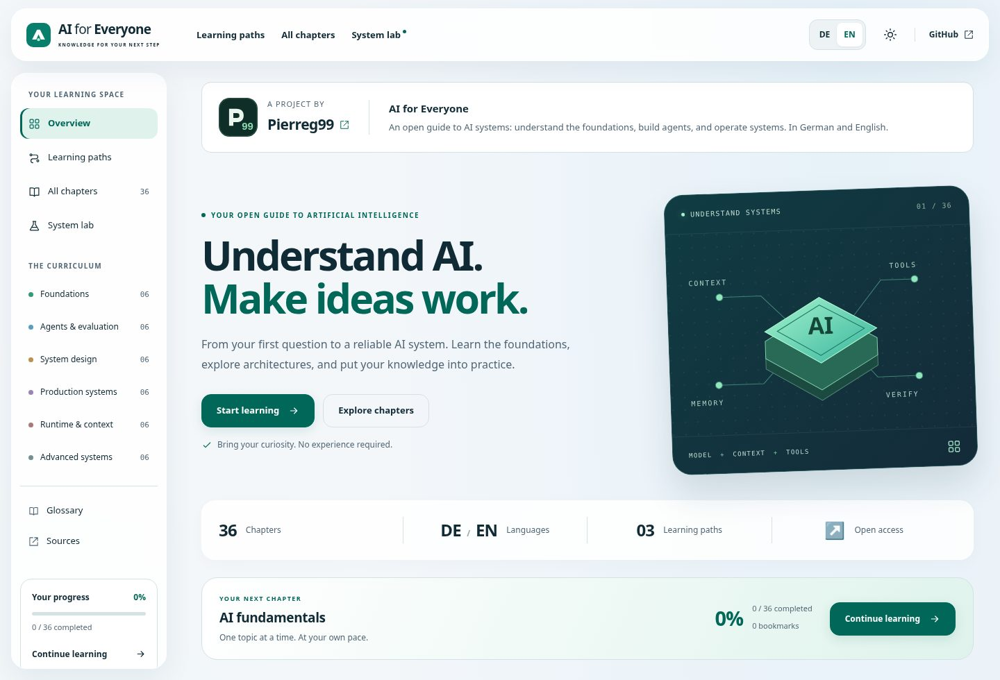

<div align="center">



# AI for Everyone

**Understand the foundations. Build agents. Operate AI systems.**

An open learning guide with 36 matched chapters in English and German.

[](package.json) [](docs/en/README.md) [](docs/language-map.md) [](https://github.com/Pierreg99/AI-FOR-Everyone-Learn-Docs/actions/workflows/ci.yml)

**[Read in English →](https://pierreg99.github.io/AI-FOR-Everyone-Learn-Docs/en/)** &nbsp; · &nbsp; **[Auf Deutsch lesen →](https://pierreg99.github.io/AI-FOR-Everyone-Learn-Docs/de/)**

[English chapters](docs/en/README.md) · [Deutsche Kapitel](docs/de/README.md) · [Deutsches README](README.de.md)

</div>

---

A project by [Pierreg99](https://github.com/Pierreg99). **The unified Codex guide on `main` is the primary edition.** Its canonical sources live in [`docs/en/`](docs/en/README.md) and [`docs/de/`](docs/de/README.md).

## Choose your starting point

| Your goal | What you will learn | Start here |
| --- | --- | --- |
| **Understand AI** | Models, machine learning, Transformers, language models, generative AI, and RAG | [AI fundamentals](docs/en/01-ai-fundamentals.md) · 6 chapters |
| **Build agents** | Tools, memory, context, permissions, architecture, and testing | [AI agents](docs/en/07-ai-agents.md) · 10 chapters |
| **Operate systems** | Observability, data, serving, recovery, evaluation, privacy, and costs | [Observability](docs/en/19-observability.md) · 12 chapters |

Start with the [quick guide](docs/en/getting-started.md), follow a path on the website, or browse [all 36 chapters](docs/en/README.md). The remaining chapters deepen architecture and research boundaries. AGI and ASI are capability and hypothetical future concepts, not guaranteed engineering milestones.

## A learning space that stays yours

<a href="https://pierreg99.github.io/AI-FOR-Everyone-Learn-Docs/en/">
  
</a>

*The actual learning website, built from this repository.*

| Read and understand | Explore and keep track |
| --- | --- |
| Every chapter includes a learning goal, worked example, limitations, exercise, answer, and primary reading | Full-text search, topic filters, and three learning paths |
| Paired German and English pages with links between matching chapters | Shared progress and bookmarks across languages in the same browser |
| Responsive light/dark layouts, a chapter outline, and reading focus (`F`) | Local JSON progress export/import and a next-chapter panel |
| Chapters and navigation remain readable without JavaScript | Architecture explorer and illustrative cost/reliability calculators |

The site has no account, analytics service, external font dependency, or runtime API. Progress stays in browser storage, with a session-only fallback if storage is unavailable. Backup files are processed locally. Search, saved progress, and interactive tools require JavaScript. Calculator prices are example assumptions, not vendor quotes.

## Learn by doing

Three small Python examples use only the standard library. Run them from the repository root with Python 3.10+:

```sh
python examples/retrieval.py --lang en --query "returns"
python examples/durable_job.py
python examples/evaluate.py
```

Try a retrieval baseline, retry an operation without duplicate database effects, and examine evaluation results by language. The [practice projects](docs/en/projects.md) explain what to check and how to extend each exercise.

## Run the website locally

**Requirements:** Node.js 22+ and npm. Python 3.10+ is also needed for `npm run check`, which runs the example tests.

```sh
npm ci
npm run check
npm run dev
```

Open **http://127.0.0.1:4173/**. `npm run build` generates the deployable static site in `dist/`; rebuild after editing a chapter. The deployed site needs no Node.js process.

For desktop/mobile browser and accessibility checks:

```sh
npx playwright install chromium
npm run test:e2e
```

## One guide, clear source files

```text
docs/
├── en/                  English chapters and reference pages
└── de/                  Matching German chapters and reference pages
data/chapters.json       Shared chapter order, topics, and prerequisites
assets/                  Styles, browser scripts, and images
scripts/                 Static build, preview server, and deployment checks
examples/                Three runnable Python exercises
tests/                   Content, link, example, and browser checks
index.html               Website template
dist/                    Generated output — ignored by Git
```

Edit the canonical language files together. Earlier V1.2 indexes and chapter addresses are compatibility links to the current guide. GitHub Pages publishes the generated `dist/` artifact through [the Pages workflow](.github/workflows/pages.yml); its deployment source must be **GitHub Actions**.

## Find a reference or contribute

| Read | Maintain |
| --- | --- |
| [Quick start](docs/en/getting-started.md) | [Contributing](CONTRIBUTING.md) |
| [Glossary](docs/en/glossary.md) | [Website and deployment](WEBSITE.md) |
| [Sources and further reading](docs/en/sources.md) | [Language architecture](docs/language-map.md) |
| [Practice projects](docs/en/projects.md) | [Roadmap](ROADMAP.md) |

Improve an explanation, try an exercise, or correct a source. Keep chapter scope, examples, exercises, and references synchronized between German and English.

---

<div align="center">

**[Start learning →](https://pierreg99.github.io/AI-FOR-Everyone-Learn-Docs/en/)**

<sub>AI for Everyone · Pierreg99 · Edition 2.2</sub>

</div>
